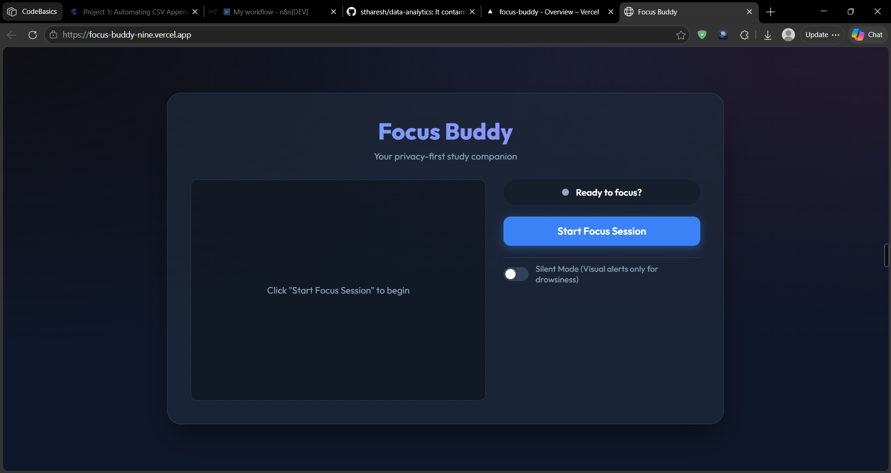
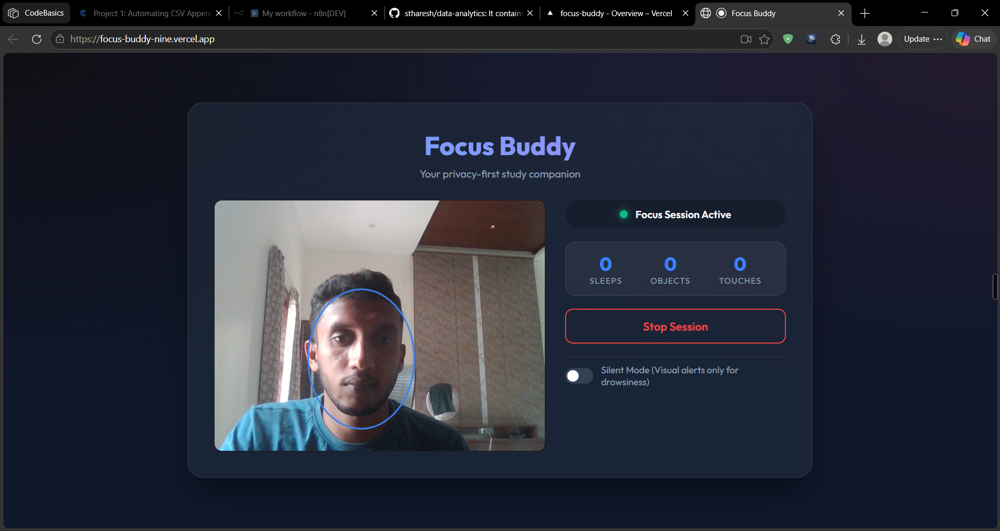
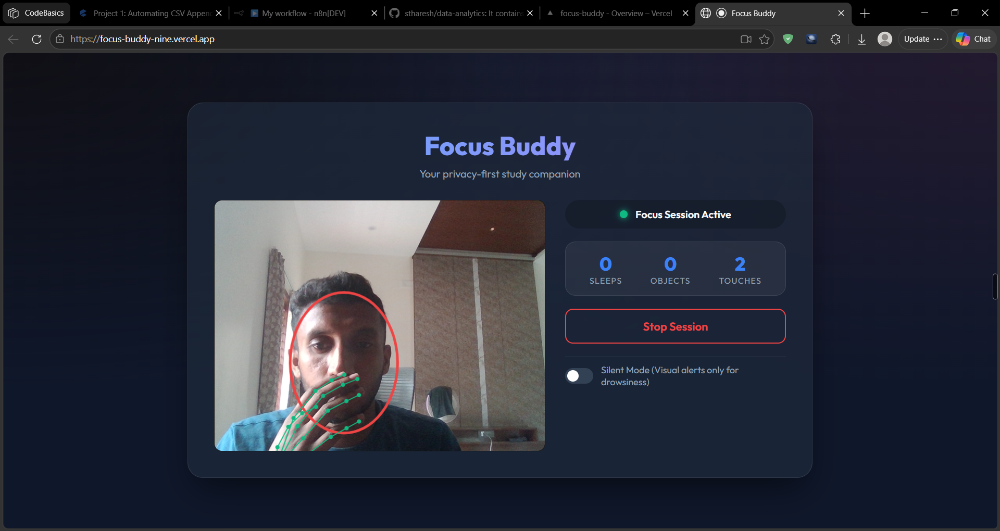

# Focus Buddy

**Focus Buddy** is an AI-assisted, browser-based focus companion. During a focus session, it uses webcam input to notice prolonged eye closure, hand-to-face contact, and objects held in hand, then gives visual or voice feedback.

The experience is designed around a privacy-first idea: webcam processing happens in the browser rather than being sent to an application backend. The application uses browser-based computer-vision tools to turn camera frames into real-time focus feedback.

**Live Demo:** https://focus-buddy-nine.vercel.app/

**Source Code:** https://github.com/stharesh/focus-buddy

---

## Overview

Focus Buddy was built around a simple problem: **how can a browser application help someone stay focused without sending webcam footage to a backend for processing?**

## Focus-session workflow

```text
Start a session
      ↓
Allow webcam access in the browser
      ↓
Focus Buddy observes three attention-related signals
      ↓
The signal must persist long enough to avoid reacting to momentary noise
      ↓
Visual or voice feedback is shown during the session
      ↓
Session event counters update in real time
      ↓
End the session and release the webcam
```

The three user-facing signals are:

- **Prolonged eye closure** as a drowsiness signal
- **Hand-to-face contact** as a potential distraction signal
- **Objects held in hand** as a possible off-task signal

The result is a real-time browser application that turns webcam frames into actionable focus feedback while keeping the session on the user’s device.

The application combines multiple computer-vision signals:

- **Face landmarks** for eye-closure / drowsiness detection
- **Hand landmarks** for detecting hand-to-face contact
- **Object detection** for identifying distracting objects
- **State-based detection logic** to avoid reacting to short-lived false positives
- **Voice and visual feedback** to alert the user
- **Session statistics** to track detected distractions

The result is a real-time browser application that turns webcam frames into actionable focus feedback.

---

## What It Does

### Drowsiness Detection

Focus Buddy calculates an **Eye Aspect Ratio (EAR)** from facial landmarks.

When measured eye openness remains below the configured threshold for approximately five seconds, the application triggers a wake-up alert.

### Face-Touch Detection

MediaPipe hand and face landmarks are used together to determine whether a hand is sufficiently close to key facial landmarks.

The application uses a short debounce threshold so brief detection noise does not immediately trigger repeated alerts.

### Object-in-Hand Detection

The application combines:

- **COCO-SSD object detection**
- **MediaPipe hand landmarks**
- **Bounding-box intersection**

When a detected object overlaps with a tracked hand, the application treats it as an object being held and can trigger a distraction alert. This is a practical heuristic, not a claim that every detected object is inherently distracting.

### Real-Time Session Dashboard

During a focus session, the UI maintains counters for:

- Drowsiness events
- Detected objects
- Face-touch events

These metrics are updated in real time as detection events occur.

### Silent Mode

Silent Mode replaces the drowsiness voice alert with a visual warning, making the application suitable for quiet study or work environments.

---

## How the experience works

```text
                    Webcam
                       |
                       v
                Video Frames
                       |
                       v
        +---------------------------+
        |     Vision Processing     |
        +---------------------------+
        |                           |
        |  MediaPipe Face Landmarks |
        |           |               |
        |           v               |
        |       EAR / Eyes          |
        |                           |
        |  MediaPipe Hand Landmarks |
        |           |               |
        |           v               |
        |     Hand / Face Distance  |
        |                           |
        |       COCO-SSD            |
        |           |               |
        |           v               |
        |     Object Detection      |
        +-------------+-------------+
                      |
                      v
             Detection Signals
                      |
                      v
          Distraction State Machine
                      |
          +-----------+-----------+
          v           v           v
      Drowsiness   Object     Face Touch
          |           |           |
          +-----------+-----------+
                      |
                      v
               Alert / Feedback
                 |           |
                 v           v
              Voice       Visual
                      |
                      v
               Session Metrics
```

---

## Supporting implementation

| Problem | Implementation |
|---|---|
| Eye-closure detection | Eye Aspect Ratio calculated from MediaPipe face landmarks |
| Drowsiness persistence | Five-second detection threshold before alerting |
| Face-touch detection | Hand/face landmark distance checks |
| Object detection | TensorFlow.js + COCO-SSD |
| Object-in-hand detection | Intersection between hand and object bounding boxes |
| Detection stability | Stateful detection with timing and debounce logic |
| Repeated alerts | Event-specific cooldown periods |
| Browser interaction | Web Camera API through `getUserMedia()` |
| Voice feedback | Browser Web Speech API |
| Quiet environments | Silent Mode with visual drowsiness feedback |
| Resource cleanup | Webcam tracks and animation loop explicitly stopped when a session ends |

---

## Alert behavior

A key part of the application is the separation between **computer-vision detection** and **user-facing alert logic**.

The vision layer produces signals such as:

```text
isDrowsy
hasObject
isHandTouchingFace
```

These signals are passed into a dedicated detection state machine.

The state machine manages:

- Detection start time
- Detection duration
- Short interruptions
- Alert thresholds
- Alert cooldowns
- Session counters
- Silent-mode behavior

For example, drowsiness is not treated as an alert simply because one frame reports low eye openness. The condition must persist long enough to reach the configured threshold.

This separation keeps the computer-vision layer focused on **detection** while the detector manages **behavior and alerting**.

---

## Application structure

The application is divided into small browser-side modules.

### `main.js`

Responsible for application lifecycle and UI behavior.

- Requests webcam permission
- Starts and stops focus sessions
- Initializes the vision processor
- Controls the application UI
- Handles Silent Mode
- Releases the camera when a session ends

### `vision.js`

Responsible for computer-vision processing.

- Initializes TensorFlow.js
- Loads COCO-SSD
- Initializes MediaPipe Face Landmarker
- Initializes MediaPipe Hand Landmarker
- Processes video frames
- Calculates EAR
- Detects hand/face contact
- Performs object/hand bounding-box intersection
- Draws detection overlays

### `detector.js`

Responsible for detection state and alert logic.

- Tracks detection duration
- Applies thresholds
- Applies cooldowns
- Maintains session statistics
- Handles Silent Mode behavior
- Coordinates alerts

### `audio.js`

Provides browser-based audio feedback using:

- Web Speech API
- Speech synthesis
- Audio context initialization

---

## Technology stack

The stack below supports the product experience; this repository focuses on the user workflow and observed behavior rather than claiming ownership of every underlying model or library implementation.

### Frontend

- HTML5
- CSS3
- Vanilla JavaScript
- Vite

### Computer Vision / AI

- MediaPipe Tasks Vision
- TensorFlow.js
- COCO-SSD

### Browser APIs

- `MediaDevices.getUserMedia()`
- Canvas API
- Web Speech API
- `requestAnimationFrame()`

### Deployment

- Vercel

---

## Privacy-Oriented Architecture

The core computer-vision processing happens in the browser rather than sending webcam frames to an application backend.

The application:

- Requests webcam access directly from the browser
- Processes video frames through client-side computer-vision models
- Does not implement a backend image-processing service
- Does not persist session statistics to a database
- Explicitly stops the webcam tracks when a session ends

The model/runtime assets required by the application are loaded from external CDN/model-hosting URLs, while the webcam processing pipeline itself runs client-side.

---

## Screenshots

Screenshots below document the application running through the live deployment.


### Focus Buddy Interface

The starting interface provides a clear entry point for beginning a focus session and enabling Silent Mode.



### Real-Time Face Tracking

Once a session begins, the application renders the face detection overlay over the webcam stream.



### Face-Touch Detection

Hand and face landmarks are processed together to detect a hand approaching the face.



### Object Detection

COCO-SSD identifies objects in the camera feed while the application combines object and hand bounding boxes to determine whether an object is being held.


---

## AI-assisted development approach

Focus Buddy was developed using an **AI-assisted development workflow**.

AI tools were used extensively to generate and iterate on the application. Product ownership focused on defining the focus-session behavior, guiding the interaction design, testing the application in the browser, and refining the alerts, thresholds, and user experience around observed behavior.

This project demonstrates an approach to building an AI-enabled product through **AI-assisted development, hands-on validation, and iterative product decisions**.

---

## Run Locally

### Prerequisites

- Node.js
- A modern browser with webcam support

### Installation

```bash
git clone https://github.com/stharesh/focus-buddy.git
cd focus-buddy
npm install
```

### Start Development Server

```bash
npm run dev
```

Open the local URL shown by Vite and allow webcam access when prompted.

### Production Build

```bash
npm run build
```

---

## Current Limitations

The current implementation is intentionally lightweight and browser-based.

Some limitations include:

- Object detection depends on the classes recognized by COCO-SSD.
- Hand-to-face detection uses landmark distance heuristics rather than a trained face-touch classifier.
- EAR-based drowsiness detection uses a fixed threshold and may vary across users and camera conditions.
- Real-time inference performance depends on the user's browser, device, GPU support, and camera resolution.
- The application currently focuses on three distraction signals rather than attempting to model overall human attention.

---

## Future Improvements

Potential directions include:

- User-specific calibration for drowsiness thresholds
- More robust hand-to-face classification
- Expanded distraction categories
- Configurable detection thresholds
- Historical session analytics
- Focus-session history and trends
- Improved mobile-device support
- More efficient inference scheduling
- Additional computer-vision signals for focus estimation

---

## Project Structure

```text
focus-buddy/
|
+-- index.html
+-- main.js
+-- vision.js
+-- detector.js
+-- audio.js
+-- style.css
+-- Focus_Buddy_PRD_v3.md
+-- package.json
+-- README.md
+-- screenshots/
|   +-- focus-buddy-home.png
|   +-- focus-buddy-session.png
|   +-- focus-buddy-face-touch.png
|   +-- focus-buddy-object-detection.png
```

---

## Live Application

**Try Focus Buddy:**  
https://focus-buddy-nine.vercel.app/

**Source Code:**  
https://github.com/stharesh/focus-buddy

---

## License

No repository license is currently configured.
